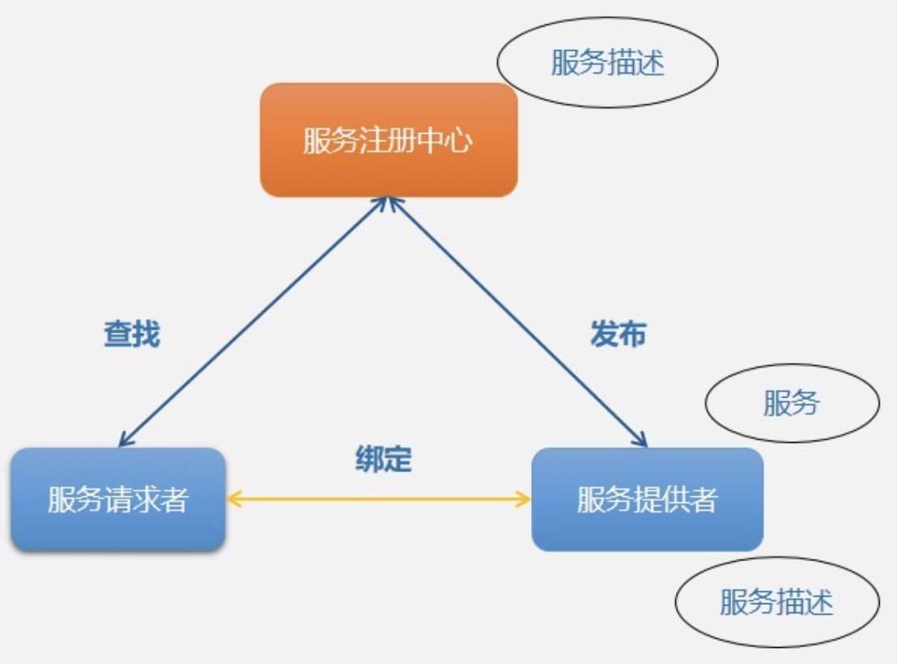
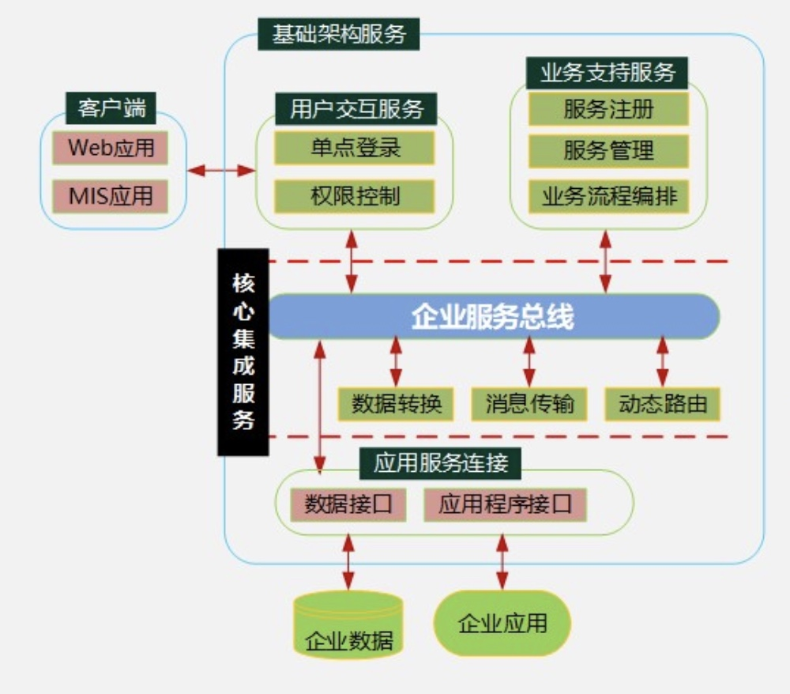

#### 1、架构设计

目的：需求分配，了解需求，将满足职责的需求分配到组件上

#### 2、架构风格：
|风格|特点|
|-|-|
|数据流风格|批处理，管道-过滤器
|调用/返回风格|主程序/子程序，面向对象，层次结构
|独立构件风格|进程通信，事件驱动系统
|虚拟机风格|解释器，规则系统
|仓库风格|数据库系统，黑板系统，超文本系统

#### 3、基于服务的架构（SOA）

优点：标准化，更利于互联互通

##### SOA实现方式：

#### 4、微服务

特点：
- 小、且专注于做一件事情
- 轻量级的通信机制
- 松耦合、独立部署

区别：
|单块架构|微服务架构|
| - | - |
|紧耦合|松耦合|
|所有功能在一个进程中|功能在不同的微服务进程中|

优势：
- 技术异构性。不同微服务使用不同的技术
- 弹性。
- 扩展。
- 简化部署。
- 与组织结构相匹配。
- 可组合性。
- 对可替代性的优化。

挑战：
- 分布式系统的复杂性
- 运维成本
- 部署自动化
- DevOps与组织结构
- 服务间依赖测试
- 服务间依赖管理

#### 5、微服务与SOA对比及实现
|微服务|SOA|
|-|-|
|能拆分的就拆分|是整体的，服务能放一起的都放一起|
|纵向业务划分|是水平分多层|
|由单一组织负责|按层级划分不同部门的组织负责|
|细粒度|粗粒度|
|两句话可以解释明白|几百字只相当于SOA的目录|
|独立的子公司|类似大公司里面划分了一些业务单元（BU）|
|组件小|存在较复杂的组件|
|业务逻辑存在于每个服务中|业务逻辑横跨多个业务领域|
|使用轻量级的通信方式，如HTTP|企业服务总线（ESB）充当了服务之间通信的角色|

|微服务架构实现|SOA实现|
|-|-|
|团队级，自底向上|企业级，自顶向下|
|一个系统拆分多个服务，粒度细|服务由多个子系统组成，粒度大|
|无集中式总线，松散的服务架构|企业服务总线，集中式的服务架构|
|集成方式简单（HTTP/REST/JSON）|集成方式复杂（ESB/WS/SOAP）|
|服务能独立部署|单块架构系统，相互依赖，部署复杂|

#### 6、架构风格-MDA（`Model Driven Architechture`）

3种核心模型：
- 平台独立模型（PIM）：具有高抽象层次，独立于任何实现技术的模型。
- 平台相关模型（PSM）：为某种特定实现技术量身定制，让你用这种技术可用的实现构造来描述系统的模型。PIM会被变换成一个或多个PSM。
- 代码：用源代码对系统的描述（规约），每个PSM都将被变换成代码。

> PIM->变换工具->PSM->变换工具->CODE

缺点：应用有限

#### 7、人机界面设计

**黄金三法则：**
- **置于用户的控制之下**
  - 不强迫
  - 灵活交互
  - 用户交互允许被中断
  - 交互流水化，允许定制交互
  - 隔离内部技术细节
  - 允许用户和屏幕上的对象直接交互
- **减少用户的记忆负担**
  - 减少短期记忆
  - 建立有意义的缺省
  - 定义直觉性的捷径
  - 界面视觉布局应基于真实世界的隐喻
  - 以不断进展的方式揭示信息
- **保持界面的一致性**
  - 允许用户将当前任务放入有意义的语境
  - 在应用系列内保持一致
  - 如过去已建立起了用户期望，除非必要，否则不要改动

#### 8、软件设计

包含：
- 结构设计。软件主要部件之间的关系。
- 数据设计。模型->数据结构定义。好的数据设计将改善程序结构和模块划分、降低过程复杂性。
- 接口设计（人机界面设计）。软件内部，软件vs操作系统，软件vs人，如何通信
- 过程设计。系统内部结构->软件过程描述。

#### 9、结构化设计

- 概要设计，外部设计，模块及其调用关系，形成模块结构图
- 详细设计，内部设计，为每个具体任务选择适当的技术手段和处理方法

**结构化设计原则**
- 模块独立（高内聚、低耦合）
- 模块大小适中
- 多扇入，少扇出
- 深度和宽度均不宜过高

**内聚由高->低：**
- 功能内聚。完成单一功能，缺一不可。
- 顺序内聚。多个处理元素顺序执行。
- 通信内聚。同一个数据结构。
- 过程内聚。按特定次序执行。
- 瞬时内聚（时间内聚）。同一时间内执行。
- 逻辑内聚。逻辑相关的一组任务。
- 偶然内聚（巧合内聚）。完成一组没有关系或松散的任务。

**耦合由低->高**
- 非直接耦合。模块间没有直接关系，完全通过控制和调用实现。
- 数据耦合。参数表传递简单数据。
- 标记耦合。参数表传递记录信息。
- 控制耦合。传递信息种包含逻辑。
- 外部耦合。访问同一简单全局变量。
- 公共耦合。同时访问同一公共数据环境。
- 内部耦合。
  - 模块间直接访问内部数据。
  - 模块间不通过正常入口访问内部。
  - 模块之间代码重复。
  - 模块有多个入口。

**模块的四个要素**
- 输入和输出。
- 处理功能。
- 内部数据。
- 程序代码。

#### 10、面向对象设计原则

- 单一职责原则：设计目的单一的类。
- 开放-封闭原则：对扩展开放，对修改封闭。
- 李氏替换原则：子类可以替换父类。不要随意在子类种重写方法。可以把父类做成接口
- 依赖倒置原则：
  - 依赖于抽象，不是具体实现；针对接口编程，不要针对实现编程。
  - 在高层做接口，底层依赖于高层，避免底层改动，高层也要改动。
- 接口隔离原则：使用多个专门的接口比使用单一的总接口要好。
- 组合重用原则：尽量使用组合，而不是继承关系达到重用目的。
- 迪米特原则原则（最少知识原则）：一个对象应当对其他对象由尽可能少的了解。

