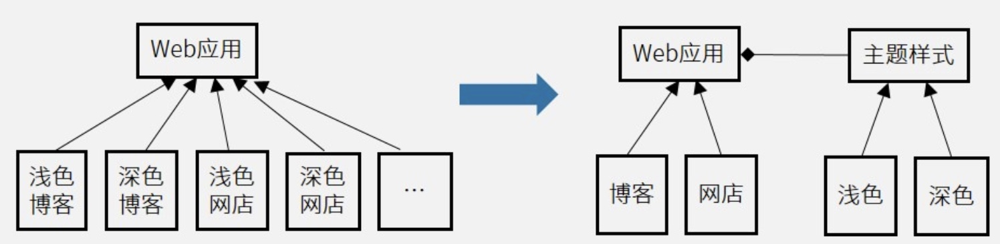

#### 1、设计模式分类

|类别|模式|En|类型|说明|特征|
|-|-|-|-|-|-|
|创建型模式：创建对象|工厂方法模式|Factory Method|纯类||动态生成对象|
||抽象工厂模式|Abstract Factory|||生产成系列对象|
||原型模式|Prototype|||克隆对象|
||单例模式|Singleton|||单实例|
||构建器模式|Builder|||复杂对象构造|
|结构型模式：更大的结构|**适配器模式**|Adapter|对象+纯类|一个接口转换成另一种接口，使得原本不相容的接口得以协同工作。|**转换**接口|
||**桥接模式**|Bridge|||继承树拆分|
||**组合模式**|Composite|||树姓目录结构|
||**装饰模式**|Decorator||||
||外观模式|Facade||||
||享元模式|Flyweight||||
||代理模式|Proxy||||
|行为型模式：交互及职责分配|**职责链模式**|Chain of Resiponsibility||||
||**命令模式**|Command||||
||解释器模式|Interpreter|纯类|||
||迭代器模式|Iterator||||
||**中介者模式**|Mediator||||
||备忘录模式|Memento||||
||**观察者模式**|Observer||||
||**状态模式**|State||||
||**策略模式**|Stratery||||
||模版方法模式|Template Method|纯类|||
||访问者模式|Visitor||||

注：
- 类模式：继承
- 对象模式：组合

