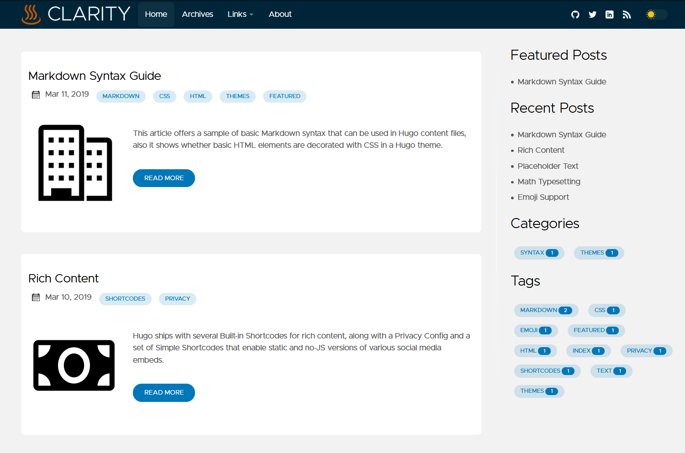

## Introduction

This is **bold** text, and this is *emphasized* text.

!Visit the [Hugo](https://gohugo.io) website!


```golang
package main

main(){
    s := []string{1,2,3}
}


```

### 一、I/O子系统概述

- 解决：各种I/O设备的功能和传输速率差异巨大
- 包括：I/O调度、缓冲与高速缓存、设备分配与回收、假脱机、设备保护、差错处理等。


### 二、I/O调度概念

定义：确定一个好的顺序来执行这些I/O请求。

- 使设备公平地共享设备访问。
- 减少I/O完成所需的平均等待时间。

### 三、高速缓存与缓冲区

#### 1、磁盘高速缓存（Disk Cache）

- 提高磁盘的I/O速度
- 用内存存储空间暂存盘块中的信息
- 属于逻辑上的磁盘
- 物理上是驻留在内存中的盘块
- 两种形式：
  - 内存中开辟一个单独空间
  - 把未利用的内存空间作为一个缓冲池

#### 2、缓冲区（Buffer）

目的：

- 缓和CPU与I/O间速度不匹配的矛盾。
- 减少对CPU的中断频率。
- 解决基本数据单元不匹配问题。
- 提高CPU与I/O设备之间的并行性。

实现方法：

- 采用硬件缓冲器，成本高。
- 采用缓冲区（内存区域）。（非空，只能传出；空，只能传入）

缓冲技术分类：

- 单缓冲。

  - 设备与处理机之间设置一个缓冲区。
  - 初始状态：工作区满，缓冲区空，大小相等（默认）


